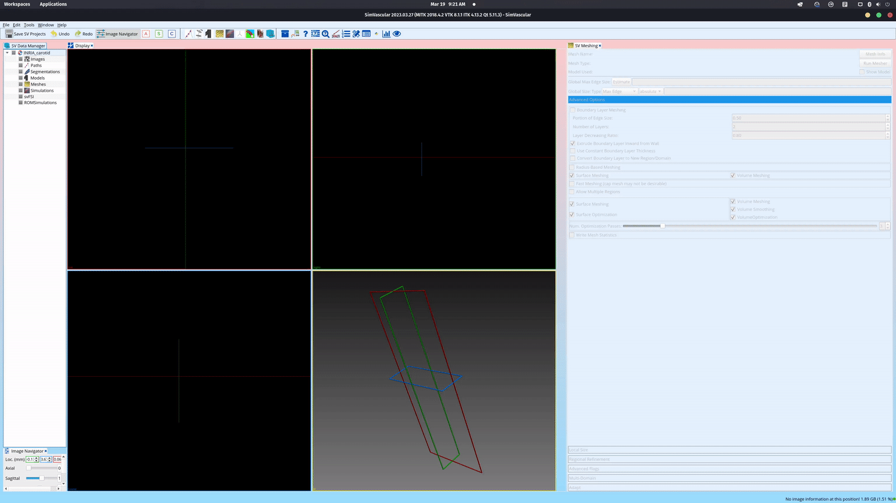
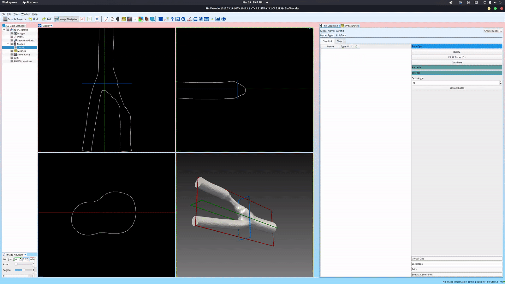
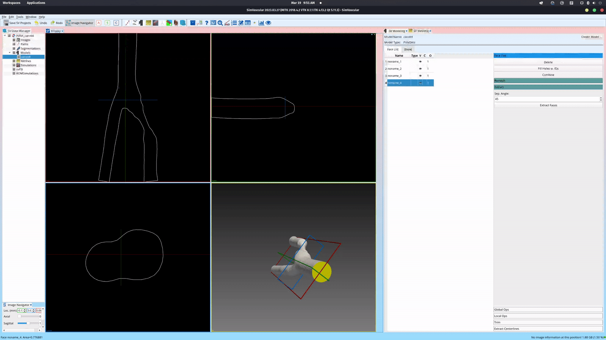
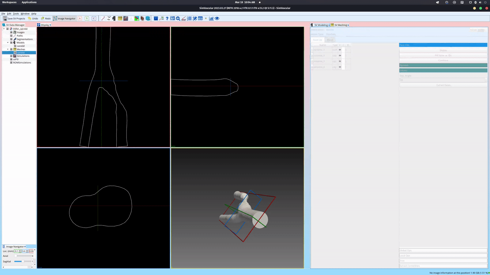

# Introduction
This repository contains a tutorial to convert ```MESH``` files (INRIA format) to a ```PolyData``` model, which is suitable to be used in SimVascular as a model for meshing. The sample file ```caroCritic_5kv.mesh``` (from now on referred simply as mesh) contains the mesh that is being used in this tutorial.

# Preparing the mesh
To obtain the ```PolyData``` model, we need to convert first the ```MESH``` file to vtk. However, before converting the mesh, we needed to remove all the fields that are not used by SimVascular. Otherwise, the software could crash at meshing step. The fields to be removed are:
- Tetrahedra
- Normals
- NormalAtVertices
- Tangents
- TangentAtVertices
- Edges
- Ridges

Leaving only the fields ```Triangles``` and ```Points```.

The mesh conversion to ```vtk``` is done using ```meshio``` as follows:
```console
meshio convert caroCritic_5kv.mesh caroCritic_5kv.vtk
```

# Converting the mesh to PolyData
The conversion from the ```vtk``` file to ```PolyData``` is done by running the Python script ```vtk2vtp.py```, which uses the ```vtk``` Python module to import, extract the information, and store the model. To execute the instructions, just run:
```console
python3 vtk2vtp.py
```

# Meshing with SimVascular
1) Open SimVascular and create a new project under ```File/Create SV Project``` or by pressing ```ctrl + N```.

2) Under the ```SV Data Manager``` tab, right-click model and click on ```Import Solid Model``` and choose the ```PolyData``` file (```caroCritic_5kv.vtp```) obtained in the previous step.



3) Select the ```carotid``` model and open the ```SV Modeling``` tab. Then, click on ```Extract``` and ```Extract Faces``` to obtain the surface faces.



4) Now select all the generated faces and click on ```Combine```, which will combine all the faces into one. Then, select the single face and repeat step 3.
**Important**: idk why but, if this step is not performed, SimVascular could give an error message during mesh generation.



5) Explore the generated faces and choose their type (wall or caps). And then, under the ```SV Data Manager``` tab, right-click ```Meshes``` and click ```Create Mesh``` and press enter.


6) Chose the created mesh and open the ```SV Meshing``` tab, choose a ```Global Max. Edge Size``` and click ```Run Mesher```. There are several meshing options that can be defined by the user not covered in this tutorial.



7) To export the generated mesh, right-click the mesh under the ```SV Data Manager``` tab and click ```Export Mesh-Complete``` and choose the destination path.

# Converting the generated mesh to other formats
The script given in ```convert_data.py``` allows converting the mesh exported from SimVascular to other formats (e.g., ```vtk```, ```xdmf```, ```INRIA mesh```, etc). The code given is based on the ```vtk``` Python library and ```meshio```. To convert the output, simply change the path in the script and run it using:

```console
python3 convert_data.py
```

# Dependencies
- Meshio: https://github.com/nschloe/meshio
- vtk Python module: https://docs.vtk.org/en/latest/api/python.html
- SimVascular: https://simvascular.github.io/

# Contributors
- Hernán Mella (email: hernan.mella@pucv.cl)